## 1. Architecture Overview

The solution is a manually initiated, single-repository analysis workflow. It reads GitHub repository metadata and content from the repository's current default branch, builds an evidence-based technical profile, reconciles it with the existing profile when present, validates the result, and presents the Markdown change for human review. Only approval through the repository's review process makes a proposed change final; a generation run does not publish directly to the default branch.

The initial architecture has one required external operational integration: GitHub. The exact trigger interface, execution environment, GitHub API choice, and pull-request creation mechanism are open decisions. GitHub Copilot Agent Mode and repository-level instructions, prompts, skills, custom agents, and hooks are capstone development capabilities; the requirements do not specify that a particular Copilot model or service must be called at runtime.

## 2. Component Architecture

```mermaid
flowchart LR
    User[Administrator or developer]
    Reviewer[Developer or designated reviewer]

    subgraph Workflow[Authorized documentation workflow]
        Trigger[Manual trigger<br/>interface open]
        Coordinator[Run coordinator]
        Config[Repository configuration]
        Auth[GitHub authentication boundary]
        Collector[Repository collector<br/>including existing profile]
        Filter[File exclusion and sensitive-content controls]
        Analyzer[Repository source analyzers]
        Evidence[Evidence and coverage catalog]
        Composer[Profile composer<br/>predefined Markdown template]
        Reconciler[Existing-profile reconciler]
        Validator[Completeness, security, consistency, and test gate]
        Proposer[Change proposer]
        Reporter[Run reporter]
    end

    GitHub[GitHub repository<br/>metadata, default-branch content, PR]

    User --> Trigger --> Coordinator
    Coordinator --> Config
    Coordinator --> Auth
    Auth <--> GitHub
    GitHub --> Collector
    Collector --> Filter --> Analyzer --> Evidence --> Composer --> Reconciler --> Validator
    Collector -->|Existing approved profile, if present| Reconciler
    Validator --> Proposer
    Proposer --> GitHub
    GitHub --> Reviewer
    Reviewer -->|Approve and merge| GitHub
    Coordinator --> Reporter
    Collector -. failure status .-> Reporter
    Validator -. validation status .-> Reporter
    Proposer -. proposal status .-> Reporter
    Reporter --> User
```

The diagram shows logical boundaries, not a selected deployment topology. In particular, it does not prescribe whether the workflow runs locally, in GitHub Actions, or in another authorized environment.

## 3. Component Responsibilities

- **Manual trigger:** Lets the configured administrator/developer request a run. Its exact interface is an Open Decision.
- **Run coordinator:** Starts and sequences one run, passes its result between components, and reports success, partial completion, or failure. It does not approve or publish documentation.
- **Repository configuration:** Supplies the single repository target. The run resolves and analyzes that repository's current default branch rather than assuming a branch name.
- **GitHub authentication boundary:** Supplies the minimum authorized access needed for repository metadata and content. Credential storage and injection mechanisms are Open Decisions; credentials must not be stored in source code or generated documentation.
- **Repository scope and content collector:** Reads relevant repository metadata and files, including documentation, source/configuration files, dependency manifests, Dockerfiles, GitHub Actions workflows, and the current `technical-profile.md` when it exists. It avoids binary and irrelevant/generated content.
- **File exclusion and sensitive-content controls:** Excludes identified sensitive files and limits material passed to analysis. The exact exclusion policy and scanning/redaction implementation are Open Decisions.
- **Repository source analyzers:** Extract verifiable facts from supported project structures, initially Java/Maven, JavaScript/Node.js, Docker, and GitHub Actions. Exact parser and version support are Open Decisions.
- **Evidence and coverage catalog:** Associates extracted facts with their repository evidence, tracks missing or conflicting information, and identifies areas not analyzed. The exact evidence-reference format is an Open Decision.
- **Profile composer:** Produces a fresh evidence-based profile using the predefined section order. Every FR-12 topic is represented in the profile. Unavailable facts are `Not Specified`; unverifiable facts are `Unable to Verify` where appropriate; conflicts are identified rather than silently resolved. It does not fill gaps by inference.

The generated profile must contain a field for every FR-12 topic, in this order. The template may format these as sections or fields, but must preserve the mapping and consistent order:

| FR-12 topic | `technical-profile.md` section/field |
|---|---|
| Application/project name | Project Overview: Name |
| Application description | Project Overview: Description |
| Programming language and runtime | Technology Stack: Languages and Runtimes |
| Frameworks and major libraries | Technology Stack: Frameworks and Major Libraries |
| Dependencies and versions | Dependencies: Dependency Names and Versions |
| Database and data technologies | Data Technologies: Databases and Related Technologies |
| APIs and integrations | APIs and Integrations |
| Configuration and environment variable names | Configuration: Environment Variable Names |
| Build tool and build commands | Build: Tool and Commands |
| Test framework and test commands | Testing: Framework and Commands |
| CI/CD configuration | CI/CD Configuration |
| Deployment and infrastructure information | Deployment and Infrastructure |
| Security-related configuration | Security Configuration |
| Logging and monitoring information | Logging and Monitoring |
| Repository and branch information | Repository: Repository and Default Branch |
| Known limitations or missing information | Limitations and Missing Information |

Each mapped field is present even when evidence is unavailable; its value follows the `Not Specified`, `Unable to Verify`, or conflict-handling rules above.
- **Existing-profile reconciler:** When a current `technical-profile.md` exists, compares it with the newly generated evidence-based profile. It refreshes generated sections from current evidence, preserves manually maintained content that cannot safely be reconciled, and flags that content for human review rather than silently removing it. The exact mechanism for identifying ownership and reconciling sections is an Open Decision.
- **Completeness, security, consistency, and test gate:** Automated validation checks:
    1. Every required section and field is present.
    2. Template structure and section order are correct.
    3. Prohibited secrets and sensitive values are absent.
    4. Missing and unverifiable evidence is handled with the required labels.
    5. Conflicting evidence is identified rather than silently resolved.
    6. Failure preservation is verified through automated tests.
    7. Repeatability is verified through automated tests where applicable.

    The gate must pass before any documentation change is handed off for human review or Pull Request creation. Specific validation tools, test framework, and thresholds are Open Decisions.
- **Change proposer:** Presents the reconciled additions, changes, and removals as a reviewable change, preferably as a GitHub Pull Request. It accepts a result only after the validation/test gate passes. It must not directly publish unreviewed content or replace the approved profile. The permissions and mechanism for creating a PR are Open Decisions.
- **Run reporter:** Writes the run outcome to workflow/CLI output, including what was generated or changed and any access, analysis, or validation failures.
- **Human reviewer:** Reviews and approves a proposed change. Approval and merge, not generation, are the human gate before the profile becomes final.

## 4. Data Flow

1. An administrator/developer configures one repository and manually starts a run.
2. The coordinator obtains the configured repository and requests its current default-branch identity and repository metadata through the GitHub authentication boundary.
3. The collector reads repository content and metadata with the configured read access and reads the existing `technical-profile.md` if present. For private repositories, access remains subject to GitHub permissions.
4. The scope and sensitive-content controls omit binary, irrelevant/generated, and identified sensitive files before relevant content is analyzed. Repository files are treated as the primary source of truth.
5. Source analyzers inspect supported documentation, source/configuration files, manifests, Dockerfiles, and GitHub Actions workflows. They extract facts and evidence without consulting out-of-scope external cloud, package registry, or deployment systems.
6. The evidence catalog records which facts are supported, unavailable, unverifiable, incomplete, or in conflict. Unclear conflicts are surfaced rather than silently resolved.
7. The composer creates a consistently ordered Markdown candidate, with every FR-12 topic represented and an automatically generated indicator. Missing details are marked `Not Specified`; unverifiable details are marked `Unable to Verify` where appropriate.
8. If an existing profile is present, the reconciler compares it with the candidate. It refreshes generated sections from current evidence, preserves manually maintained content that cannot safely be reconciled, and flags that content for review. The resulting diff clearly shows proposed additions, changes, and removals. The ownership/reconciliation mechanism is an Open Decision.
9. The completeness/security/consistency checks and automated-test gate verify every required field, template structure and section order, sensitive-value exclusion, missing/unverifiable/conflicting-information handling, failure preservation, and repeatability where applicable. The gate must pass before any change is handed off for human review or Pull Request creation; failure blocks handoff and is reported.
10. After the gate passes, the change proposer makes the reconciled change available for human review, preferably through a Pull Request. The approved profile on the default branch remains unchanged while the proposal is pending.
11. A developer or designated reviewer inspects and approves the proposal. Approval and merge are the publication gate. The GitHub change and Pull Request form the primary audit trail.
12. The workflow/CLI output reports the run result and identifies generated or changed documentation. If generation or validation fails, the previously approved documentation remains available and unchanged.

## 5. Integration Points

| Integration | Initial-version interaction | Boundary or open point |
|---|---|---|
| GitHub repository metadata and contents | Read repository identity, default-branch metadata, relevant files, and the existing `technical-profile.md` when present for public or authorized private repositories. | Minimum read permissions are required. The specific GitHub API/interface, authentication type, and credential provider are Open Decisions. |
| GitHub review workflow | Present the proposed `technical-profile.md` change for review, preferably in a Pull Request; use the review/merge process as the approval gate. | Read-only access alone may not permit creating a PR. The required write scope, a separate narrowly scoped credential, or another authorized proposal handoff must be resolved before implementation. |
| Manual workflow/CLI output | Accept a manual run request and report its result and changed documentation. | Exact interface is an Open Decision. |
| Copilot Agent Mode and repository customization | Support the capstone's AI-assisted development using Agent Mode and, where appropriate, repository instructions, prompts, skills, custom agents, and hooks. | This is a development capability in the requirements; a runtime model/provider integration is not specified. |
| External documentation, cloud, package, and collaboration systems | No initial-version integration. | Confluence synchronization, external deployment/cloud/package systems, and email/Slack notifications are future or out of scope. |

## 6. Security Architecture

- **Trust boundaries:** GitHub repository content is private or public input controlled by repository contributors; the analysis workflow is an authorized processing boundary; the proposed PR is visible according to the repository's access controls; the reviewer is the approval boundary. Private content must not be exposed outside the authorized workflow.
- **Least privilege:** Repository reads use the minimum permissions needed for contents and metadata. PR creation is a separate permission need and must not be silently added to the read credential; its implementation is an Open Decision.
- **Credential handling:** Credentials, tokens, and secrets are not placed in source code or generated documentation. The runtime credential provider and retention behavior are Open Decisions and must satisfy these constraints.
- **Input minimization:** Binary, irrelevant/generated, and identified sensitive files are excluded from documentation analysis. Environment variables are documented by name only; values are not included. `.env` files, credential files, private keys, and other identified sensitive files are not emitted into the profile.
- **Output gate:** The generated profile is checked for prohibited secrets and sensitive values before it is proposed. If it fails this check, the proposal is blocked and the user receives a run result. The exact secret-detection approach remains open.
- **Content handling:** Repository facts must remain within an authorized workflow. Whether processing uses an external model/service, and under what data-handling terms, is an Open Decision; no external content transfer is assumed by this architecture.
- **Human approval:** The workflow cannot publish an unreviewed profile. A proposed change remains separate from the approved default-branch documentation until reviewed and merged.
- **Repository commands:** Requirements call for inspection of build and test commands, not their execution. Running repository-provided scripts is not part of this baseline architecture; whether any commands may be executed is an Open Decision.

## 7. Error Handling

| Boundary or scenario | Required behavior |
|---|---|
| Invalid repository configuration or inaccessible repository | Stop the run, report the failure clearly, and do not generate a misleading profile. |
| Authentication or repository permission failure | Report an actionable access/authentication failure; do not create a proposal or alter approved documentation. |
| Missing individual files or unsupported structures | Continue analysis where possible, mark unavailable facts `Not Specified`, and identify incomplete areas. |
| Conflicting or unverifiable evidence | Do not silently choose an answer. Surface the conflict or mark the detail `Unable to Verify`, as applicable. |
| Existing manually maintained profile content cannot be safely reconciled | Preserve the content in the proposed result and flag it for human review; do not silently remove it. If a safe proposal cannot be produced, block handoff and leave the approved profile unchanged. |
| Sensitive file or secret detected | Exclude sensitive files and block any output containing prohibited values; report the relevant validation failure without echoing the secret. |
| Completeness, security, consistency, or automated-test gate fails | Do not hand off a proposal. Report failed or incomplete checks and leave the approved profile unchanged. |
| Analysis, composition, or validation failure | Report the failed/incomplete stage and avoid proposing an invalid or misleading profile. |
| PR/proposal handoff failure | Report that the proposal was not created or delivered. Do not publish directly as a fallback; leave the approved profile unchanged. |
| Any generation failure | Preserve the last approved documentation and allow recovery by rerunning the workflow. |

Failure handling is fail-safe with respect to the approved profile: generation cannot delete, corrupt, or replace it. Exact retry policy, timeouts, and diagnostic detail are Open Decisions; diagnostics must not disclose secrets or unauthorized repository content.

## 8. Technology Choices

| Area | Choice or status | Rationale |
|---|---|---|
| Documentation format | Markdown | Required format; readable in GitHub and suitable for review as a repository change. |
| Artifact location | `technical-profile.md` in the analyzed repository | Required primary artifact and colocated with its source evidence. |
| Review and publication | Human-reviewed change, preferably a GitHub Pull Request | Required human-in-the-loop approval and an auditable proposed diff; no direct publication of unreviewed output. |
| Repository integration | GitHub authentication and access to repository metadata/content | Required source and access model. The API/interface and authentication mechanism remain Open Decisions. |
| Analysis capability | Source analyzers for Java/Maven, JavaScript/Node.js, Docker, and GitHub Actions | Matches initial compatibility requirements. Parser libraries and version support remain Open Decisions. |
| Generation structure | Predefined Markdown template plus evidence-based composition and validation | Supports consistent section order, traceability, missing-data labels, and repeatability without inventing facts. The implementation/runtime is an Open Decision. |
| AI-assisted development | GitHub Copilot Agent Mode; repository instructions, prompts, skills, custom agents, and hooks where appropriate | Explicit capstone constraint. This does not select a runtime model/provider. |
| Execution, hosting, and configuration storage | **Open Decision** | Requirements specify a manual workflow and GitHub access, but do not choose local execution, GitHub Actions, another runner, or a configuration/credential store. |
| Test framework, secret scanner, and GitHub PR mechanism | **Open Decision** | Automated validation and secret exclusion are required, but specific tools and PR write-access design are not specified. |

## 9. Deployment View

The deployment view is intentionally logical because the requirements do not select a runner, hosting environment, or runtime. A manual trigger starts a bounded analysis run in an environment authorized to read the configured repository. That run communicates with GitHub for metadata and content, performs filtering, analysis, composition, and validation, then hands a proposed change to the GitHub review workflow. The user receives status through workflow/CLI output.

No separate database, queue, always-on service, or external documentation platform is required by the initial requirements. Repository configuration and credential storage locations, run-state retention, concurrency behavior, and whether the execution environment is local or hosted are Open Decisions. Any selected deployment must keep private repository data within the authorized workflow and preserve the approved profile when a run fails.

## 10. Architecture Decisions

- **AD-01: One repository per run.** Limit scope to one configured repository and document it as a whole; do not produce per-service monorepo profiles.
- **AD-02: Resolve the default branch from GitHub.** Analyze the current default branch rather than assuming a branch name.
- **AD-03: Use repository evidence as the source of truth.** Do not infer unavailable facts; identify conflicts, and label missing or unverifiable information.
- **AD-04: Generate a structured Markdown artifact.** Write the proposed profile to `technical-profile.md` using a predefined, consistently ordered template.
- **AD-05: Keep human approval in the publication path.** A generated change is a proposal; a developer/designated reviewer must review and approve it before it becomes final. A Pull Request is preferred, not assumed as the only possible handoff until its mechanism and permissions are decided.
- **AD-06: Protect the approved artifact.** A failed or incomplete run must not replace, delete, or corrupt the last approved documentation.
- **AD-07: Apply least privilege and sensitive-content controls.** Read only what is needed, exclude identified sensitive files, never emit secret values, and do not expose private content outside the authorized workflow.
- **AD-08: Keep the initial trigger manual.** Design for possible future scheduled or repository-change triggers, but do not include them in initial scope.
- **AD-09: Keep external analysis out of the initial version.** Do not depend on cloud, deployment, package-registry, or external documentation services for profile facts.
- **AD-10: Reconcile against the existing profile.** If `technical-profile.md` exists, read it before generating the new profile and use the existing approved profile as reconciliation input. Refresh generated sections from current evidence; do not silently delete manually maintained content. Preserve and flag content that cannot safely be reconciled. Make additions, modifications, and removals visible in the reviewable diff. Any generation failure leaves the approved profile unchanged. The exact ownership/reconciliation mechanism remains open.
- **AD-11: Require completeness and validation before proposal.** Every FR-12 topic must appear in the profile; unavailable information is `Not Specified`, unverifiable information is `Unable to Verify` where appropriate, and conflicts are identified. Automated validation checks required fields, template structure and section order, sensitive-value absence, missing/unverifiable-information handling, conflict handling, failure preservation, and repeatability where applicable. The gate must pass before any change is handed off for human review or Pull Request creation. The framework and scanner remain open.

## 11. Risks and Assumptions

### Risks

- **Read/write permission mismatch:** The requirements call for minimum read access and prefer automated PR creation, which may require additional GitHub permissions. Resolve this before choosing the PR handoff; do not broaden privileges implicitly.
- **Sensitive data leakage:** Secrets may occur in ordinary source/configuration files, not only in named secret files. An effective output check is required, but its tool and coverage are open decisions.
- **Unsupported or ambiguous repository evidence:** The supported project types and small-to-medium repository target do not define all file formats, size limits, or exclusion patterns. Analysis may therefore be incomplete and must report that honestly.
- **Generated-content accuracy and repeatability:** AI-assisted generation can misstate or inconsistently phrase evidence. Grounding statements in evidence, stable template structure, explicit missing/conflict labels, and automated tests mitigate this risk; exact mechanisms remain open.
- **Existing-profile reconciliation:** Manually maintained text may not map cleanly to generated sections. Preserve uncertain content and flag it for review; define section ownership/reconciliation behavior without silently deleting content.
- **Coverage/validation drift:** Template changes or analyzer gaps could omit required topics or weaken checks. The FR-12 field mapping and pre-proposal gate address this risk; exact test/scanner tools remain open.
- **Private-content processing boundary:** A runtime model/provider could expose private content if selected without appropriate authorization and data-handling controls. Provider and processing location remain open decisions.
- **Interactive time target:** Five minutes is approximate and “typical repository” is undefined. Establish a representative benchmark before treating the target as measurable.
- **Branch changes during a run:** The requirements specify current default-branch state but do not define snapshot semantics if that branch changes while analysis is in progress. Consistent source-state identification is an Open Decision.

### Assumptions and dependencies

- The configured GitHub credentials can read the selected repository's metadata and relevant content; private-repository support depends on the user granting that access.
- GitHub is available for repository reads and, if selected, the review/proposal workflow.
- A predefined profile template will be supplied or agreed as part of implementation; it must include a corresponding field for every FR-12 topic in a consistent order. Exact heading wording is not otherwise prescribed.
- A compatible, authorized execution environment and credential provider must be selected before implementation; neither is prescribed here.
- The exact manual trigger, GitHub API/authentication choices, PR creation permissions, evidence-reference format, file exclusions, supported versions, secret-analysis method, test tooling, and mechanism for identifying/reconciling manually maintained profile sections remain **Open Decisions**.
- Confluence or another external documentation platform, scheduled/event triggers, and collaboration-tool notifications are future enhancements, not initial-version dependencies.